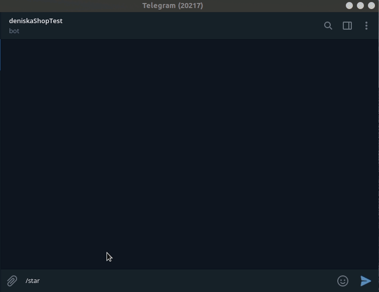

# Bot fishing store

It is a fishing store market realized in telegram via [Elastic Path Enterprise Digital Commerce Market Place](https://www.elasticpath.com/) and Telegram. For storage of conversation status is used Reddis database.

## Project description

Placeholder
To get access token:

```bash
python get_access_token.py
```

To run telegram_bot:

```bash
python telegram_bot.py
```

Example of telegram bot (or you can find it here: @fish_dvm_store_bot):



## Instalation

Python3 should be already installed. Then use pip (or pip3, if there is a conflict with Python2) to install dependencies:

```bash
pip install -r requirements.txt
```

There is enviroment variables using in the application, you will need tp create ```.env``` file. A ```.env``` file is a text file containing key value pairs of all the environment variables required by the application. You can see example of it below:

```python
# example of environment variables defined inside a .env file
TOKEN_TELEGRAM=1253123421:qT9Xbp451_v8tXnrdQJNgexnafs9zJsAnd1
TG_TOKEN_LOGGING = 9817234321:tqHQb4NPQ_CXK93kBaXG3UWpdij02qrbPpQ
TG_USER_ID=467543086
REDDIS_HOST=redis-12321.c300.eu-central-1-2.ec2.cloud.redislabs.com
REDDIS_PORT=12321
REDDIS_PASS=1aCf8TcjkVFzswEtjq2CR6kc2jpQVcx8
ELASTICPATH_CLIENT_ID=b6rfKLcLP5awt4JkHkYysMhuewRL0bhMrxxasaDAYi
ELASTICPATH_CLIENT_SECRET=P2gpFXwxKP6vuEGZTZkpFF7D4Y1eRxAsuk5AMQErtB
ELASTICPATH_ACCESS_TOKEN=6rN3TUiGtBgrfAFgtYuxiFdqKup41MzyXczfLDkjZV
```

TOKEN_TELEGRAM - to get it please writte to Telegram @BotFather bot, first you shall ```/start``` command, than ```/newbot```, than follow the instruction in Telegram.  

TG_TOKEN_LOGGING - to get it please writte to Telegram @BotFather bot, first you shall ```/start``` command, than ```/newbot```, than follow the instruction in Telegram.

TG_USER_ID - to get it please writte to Telegram @userinfobot. Send ```/start``` command to the bot.

REDDIS_HOST, REDDIS_PORT, REDDIS_PASS - you will get [there](https://redislabs.com/)

ELASTICPATH_CLIENT_ID, ELASTICPATH_CLIENT_SECRET - you will get [there](https://www.elasticpath.com/)

ELASTICPATH_ACCESS_TOKEN - use ```get_access_token.py``` to get it.


## Project Goals

The code is written for educational purposes on online-course for web-developers [Devman](https://dvmn.org)
